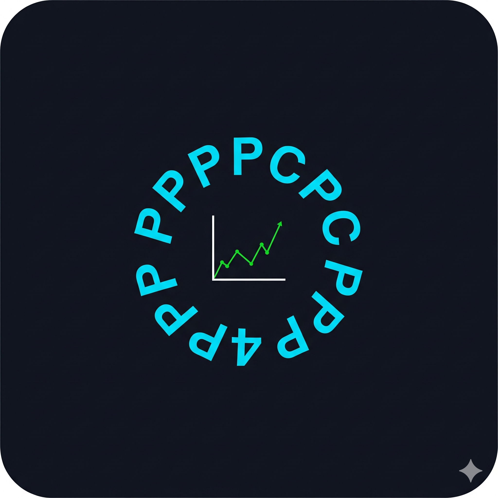

<p align="center">
  
</p>

# 📟 TastyMechanics

A Streamlit dashboard for analysing your TastyTrade options trading history. Upload your CSV export and get a full breakdown of realized P/L, wheel campaigns, trade analytics, and portfolio health — all running locally or on Streamlit Community Cloud. Your data is never sent anywhere.

  

---

## Try it online

Hosted on Streamlit Community Cloud — upload your CSV and explore without installing anything:

https://tastymechanics-76dxruw38qjhqc2bdxgfrc.streamlit.app/

---

## Features

**Portfolio Overview**
- Realized P/L, Return on Capital, Capital Efficiency Score (annualised)
- Capital deployed, margin loan, dividends + interest
- Inline P/L breakdown chips (campaign type and windowed components)
- Period comparison card — current vs prior equivalent window with deltas
- Expiry alert strip — all options expiring within 21 days, colour-coded by urgency

**Derivatives Performance tab**
- Premium selling scorecard: win rate, median capture %, median days held, annualised return, banked $/day
- Avg winner / loser, win/loss ratio, total fees and fees as % of P/L
- Call vs Put performance table
- Defined vs Undefined Risk breakdown by strategy
- Performance by ticker table
- DTE at open distribution, rolling win rate chart
- Options P/L by week and month (candlestick — shows equity curve OHLC per period)

**Trade Analysis tab**
- ThetaGang metrics: management rate, median DTE at open/close, top-3 concentration score
- LEAPS automatically separated from short-premium metrics (DTE > 90 threshold)
- DTE at close distribution chart with TastyTrade target zone highlighted
- Rolling 10-trade win rate over time
- Win/Loss P/L histogram
- P/L heatmap by ticker and month

**Wheel Campaigns tab**
- Per-ticker campaign cards: entry basis, effective basis, premiums banked, realised P/L
- Option roll chain visualisation — calls and puts tracked as separate chains
- Share and dividend event log per campaign
- Lifetime "House Money" mode toggle (in-tab, right of heading)

**All Trades tab**
- Full ticker breakdown: premiums, dividends, options P/L, capital deployed
- Total portfolio P/L by week and month (FIFO-correct, candlestick charts)
- Volatility metrics: avg week P/L, weekly std dev, Sharpe-equivalent, profitable weeks %, max drawdown + recovery

**Deposits, Dividends & Fees tab**
- Full income and cash movement log with colour-coded row types

**HTML Report Export**
- Download button in sidebar generates a self-contained dark-theme HTML file
- Includes: Portfolio Overview scorecard, Options Trading scorecard (credit trades only), equity curve, weekly/monthly candle charts, performance by ticker table
- Reflects the currently selected time window
- No external dependencies — Plotly charts embedded via CDN

---

## Getting Started (local)

### Requirements

```
python >= 3.10
streamlit >= 1.30
pandas >= 2.0
plotly >= 5.0
```

### Install

```bash
pip install streamlit pandas plotly
```

### Run

```bash
streamlit run tastymechanics.py
```

Then open `http://localhost:8501` in your browser.

### Getting your CSV from TastyTrade

> Don't have a TastyTrade account yet? [Open one here](https://tastytrade.com/welcome/?referralCode=NT57Z3P85B) — this app was built and tested exclusively on TastyTrade exports.

1. Log in to TastyTrade
2. Go to **History → Transactions**
3. Set your date range — **export your full account history, not just a recent window**
4. Click **Download CSV**
5. Upload the file in the dashboard sidebar

> **Why full history matters:** FIFO cost basis for equity P/L requires all prior buy transactions to be present, even if the shares were purchased years ago. A partial export will produce incorrect basis and P/L figures for any position that has earlier lots outside the selected date range.

---

## Deploying to Streamlit Community Cloud

1. Fork this repository
2. Go to [share.streamlit.io](https://share.streamlit.io) and sign in with GitHub
3. Click **New app** → select your fork → set main file to `tastymechanics.py`
4. Deploy — no secrets or environment variables required

---

## Docker

A standard Python slim image works. Ensure Python 3.10+ is used:

```dockerfile
FROM python:3.12-slim
WORKDIR /app
COPY . .
RUN pip install streamlit pandas plotly
EXPOSE 8501
CMD ["streamlit", "run", "tastymechanics.py", "--server.port=8501", "--server.address=0.0.0.0"]
```

> **Note:** Python 3.10 and 3.11 are supported. Python 3.12 is recommended.

---

## Disclaimer

This tool is for personal record-keeping only. It is not financial advice.

**Known limitations — verify these manually if they apply to your account:**

- **Covered calls assigned away** — if your shares are called away by assignment, verify the campaign closes and P/L records correctly.
- **Multiple assignments on the same ticker** — each new buy-in starts a new campaign. Blended basis across campaigns is not combined.
- **Long options exercised by you** — exercising a long call or put into shares is untested. Check the resulting position and cost basis.
- **Futures options delivery** — cash-settled futures options (/MES, /ZS etc.) are included in P/L totals, but in-the-money expiry into a futures contract is not handled.
- **Stock splits** — forward and reverse splits are detected and FIFO-adjusted, but TastyTrade-issued post-split option symbols are not stitched to pre-split contracts.
- **Spin-offs and zero-cost deliveries** — shares received at $0 cost (spin-offs, ACATS transfers) trigger a warning. A sidebar toggle lets you exclude those tickers from all P/L metrics so the inflated basis doesn't distort Realized ROR or Capital Efficiency.
- **Mergers and acquisitions** — if a held ticker is acquired or merged, the original campaign may be orphaned with no exit recorded and incomplete P/L. Reconcile manually against your broker statement.
- **Complex multi-leg structures** — PMCC, diagonals, calendars, and ratio spreads may not be classified correctly in the trade log. P/L totals are correct; trade type labels may not be.
- **Non-US accounts** — built and tested on a US TastyTrade account. CSV format and field differences for other regions are unknown.

P/L figures are cash-flow based (what actually hit your account) and use FIFO cost basis for equity. They do not account for unrealised gains/losses, wash sale rules, or tax adjustments. Always reconcile against your official TastyTrade statements for tax purposes.

---

## Architecture

The codebase is split into focused modules with a strict one-way dependency chain. No module imports from the one above it.

```
config.py          Constants + COLOURS palette — OPT_TYPES, TRADE_TYPES, thresholds, patterns
models.py          Dataclasses — Campaign, AppData, ParsedData
ingestion.py       CSV parsing — pure Python, no Streamlit dependency
mechanics.py       Analytics engine — FIFO, campaigns, trade classification
ui_components.py   Visual helpers — formatters, colour functions, chart layout
report.py          HTML report export — self-contained, no Streamlit dependency
tabs/              One renderer per tab (tab0–tab5) — imported by tastymechanics.py
tastymechanics.py  Streamlit wiring — sidebar, cache wrappers, tab orchestration
```

**Data flow**

```
CSV upload
  └── load_and_parse(_file_bytes)        cached on raw bytes — reruns only on new file
        └── build_all_data(_parsed, use_lifetime)
                                          cached on use_lifetime bool only (DataFrame unhashed)
              └── window slices recomputed on time window change (fast, uncached)
```

See the [Architecture wiki page](https://github.com/crux1s/TastyMechanics/wiki/Architecture) for full detail.

---

## Changelog

**v25.12 — Charts, Report Export & Fixes** (2026-03-01)
- Weekly and Monthly P/L bar charts replaced with **candlestick charts** — candles show cumulative P/L equity curve OHLC per period; wicks reveal intra-period swings
- **HTML report export** — sidebar download button generates a self-contained dark-theme HTML file with two scorecard sections (Portfolio Overview and Options Trading — Credit Trades Only), equity curve, candle charts, and performance by ticker table
- Lifetime "House Money" toggle moved from sidebar into the Wheel Campaigns tab header
- f-string quote conflicts fixed in `ui_components.py` — resolves `SyntaxError` on Python < 3.12 (Unraid Docker and similar deployments)
- `datetime.utcnow()` replaced with `datetime.now(timezone.utc)` — removes deprecation warning on Python 3.12+
- 13-colour `COLOURS` palette added to `config.py`; `ui_components.py` fully migrated — all hex codes replaced with named references
- Test suite expanded from 258 to **294 tests** (Section 24: `xe()`, `identify_pos_type()`, `detect_strategy()`)
- `detect_strategy()` Call Butterfly false positive fixed — was matching Call Debit Spread on `lc==2, sc==1, 3 strikes`
- `detect_strategy()` Long Call false positive fixed — `lc>0` matched 2+ lone calls; corrected to `lc==1`
- TSLA Call Debit Spread VERIFIED test added — cross-checked against TastyTrade UI

**v25.11 — Refactor & Testing** (2026-02-28)
- Six tab render functions extracted from `main()` into module-level scope — `main()` reduced from 2,191 to 875 lines
- Union-Find helpers extracted from `build_closed_trades` to module level — now independently testable
- `_write_test_snapshot` refactored from 22 positional parameters to a single `ctx` dict
- Time window selection replaced 7-branch `if/elif` chain with `_WINDOW_START` dict lookup
- Test suite expanded from 185 to 258 tests (23 sections)
- Three **VERIFIED** tests added — P/L figures cross-checked against live TastyTrade UI

**v25.10 — Bug Fixes** (2026-02-27)
- `realized_ror` recomputed after zero-cost exclusion filter
- `pure_options_pnl()` boundary condition fixed
- FIFO zero-quantity guard added
- Column rename: `_dsc` → `dsc_upper` (Windows `itertuples` fix)

**v25.9 — Refactor** (2026-02-27)
- Extracted pure analytics into `mechanics.py`, models into `models.py`, CSV parsing into `ingestion.py`, constants into `config.py`, UI helpers into `ui_components.py`
- All `@st.cache_data` wrappers moved to app layer
- Main app reduced from ~2,940 to ~1,730 lines

**v25.6** (2026-02-26) — Stock split handling, zero-cost delivery warnings, short equity FIFO fix, LEAPS separation, timezone architecture unification.

**v25.4** (2026-02-24) — Pre-purchase option campaign fix, prior period double-count fix, weekly/monthly P/L charts.

**v25.3** (2026-02-23) — Expiry alert strip, period comparison card, open positions card grid, dark theme.

---

## License

[AGPL-3.0](./LICENSE) — free to use, modify, and distribute. If you run a modified version as a public web service you must open source your changes under the same licence.

---

## Support the Project

TastyMechanics is free and open source. If it's saved you time or helped you trade smarter, a coffee goes a long way toward covering the 5-sigma moves.

[](https://www.buymeacoffee.com/Cruxis)

Not on TastyTrade yet? [Open an account here](https://tastytrade.com/welcome/?referralCode=NT57Z3P85B) — it costs you nothing extra and helps fund continued development.
