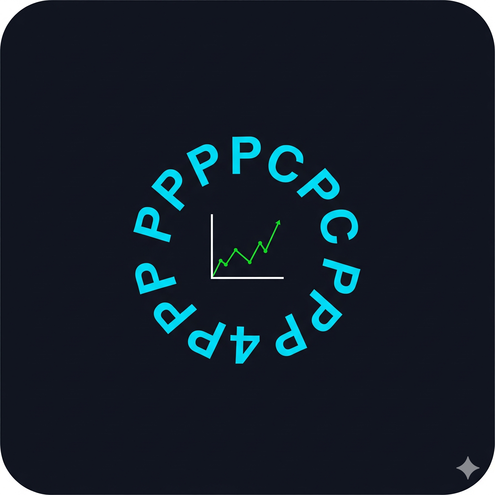

<p align="center">
  
</p>

# 📟 TastyMechanics

A Streamlit dashboard for **theta and wheel strategy traders** on TastyTrade. Built around premium selling — short puts, covered calls, strangles, and the wheel — with metrics that matter for multi-day holds: capture %, annualised return, banked $/day, effective basis, and campaign tracking.

Upload your CSV export and get a full breakdown of realized P/L, wheel campaigns, trade analytics, and portfolio health — all running locally or on Streamlit Community Cloud. Your data is never sent anywhere.

> **Heads up for 0DTE traders:** the app works but some metrics (Ann Return %, Med Premium/Day, Wheel Campaigns) are less meaningful for same-day trades. 0DTE-specific analytics are on the roadmap.


> **Personal project.** TastyMechanics is built around how I trade — wheel strategies, theta harvesting, and premium selling on TastyTrade. It works well for my account and my style. It may not fit yours out of the box, and that is intentional. If you trade differently — 0DTE, futures, spreads-heavy, non-US — the numbers may not tell the full story. You are welcome to fork the repo and customise it to match your trading style. The codebase is modular by design: analytics live in `mechanics.py`, display in `tabs/`, constants in `config.py`. Changing a metric or adding a new one is usually a small, contained change.

---

## Welcome Screen


  

<a href="https://www.buymeacoffee.com/Cruxis" target="_blank">
  
</a>

---

## Try it online

Hosted on Streamlit Community Cloud — upload your CSV and explore without installing anything:

https://tastymechanics-76dxruw38qjhqc2bdxgfrc.streamlit.app/

---

## Features

**Open Positions tab**
- Position cards per ticker: strategy badge, DTE progress bar, cost basis per leg
- Live market prices via Yahoo Finance (opt-in toggle) — last price, day change, mark for options, unrealised P/L per leg and card total
- Expiry alert strip — all options expiring within 21 days, colour-coded by urgency

**Portfolio Overview**
- Realized P/L, Return on Capital, Capital Efficiency Score (annualised)
- Capital deployed, margin loan, dividends + interest
- Inline P/L breakdown chips (campaign type and windowed components)
- Period comparison card — current vs prior equivalent window with deltas

**Derivatives Performance tab**
- Premium selling scorecard: win rate, median capture %, median days held, annualised return, banked $/day
- Avg winner / loser, win/loss ratio, total fees and fees as % of P/L
- Call vs Put performance table
- Defined vs Undefined Risk breakdown by strategy
- Performance by ticker table
- DTE at open distribution, rolling win rate chart
- Options P/L by week and month (candlestick — shows equity curve OHLC per period)

**Trade Analysis tab**
- ThetaGang metrics: management rate, median DTE at open/close, top-3 concentration score
- LEAPS automatically separated from short-premium metrics (DTE > 90 threshold)
- DTE at close distribution chart with TastyTrade target zone highlighted
- Rolling 10-trade win rate over time
- Win/Loss P/L histogram
- P/L heatmap by ticker and month

**Wheel Campaigns tab**
- Per-ticker campaign cards: entry basis, effective basis, premiums banked, realised P/L
- Option roll chain visualisation — calls and puts tracked as separate chains
- Share and dividend event log per campaign
- Lifetime "House Money" mode toggle (in-tab, right of heading)

**All Trades tab**
- Full ticker breakdown: premiums, dividends, options P/L, capital deployed
- Total portfolio P/L by week and month (FIFO-correct, candlestick charts)
- Volatility metrics: avg week P/L, weekly std dev, Sharpe-equivalent, profitable weeks %, max drawdown + recovery

**Deposits, Dividends & Fees tab**
- Full income and cash movement log with colour-coded row types

**HTML Report Export**
- Download button in sidebar generates a self-contained dark-theme HTML file
- Includes: Portfolio Overview scorecard, Options Trading scorecard (credit trades only), equity curve, weekly/monthly candle charts, performance by ticker table
- Reflects the currently selected time window
- No external dependencies — Plotly charts embedded via CDN

---

## Getting Started (local)

### Requirements

```
python >= 3.10
streamlit >= 1.30
pandas >= 2.0
plotly >= 5.0
yfinance >= 0.2   # optional — only required for live market prices
```

### Install

```bash
pip install -r requirements.txt
```

### Run

```bash
streamlit run tastymechanics.py
```

Then open `http://localhost:8501` in your browser.

### Getting your CSV from TastyTrade

> Don't have a TastyTrade account yet? [Open one here](https://tastytrade.com/welcome/?referralCode=NT57Z3P85B) — this app was built and tested exclusively on TastyTrade exports.

1. Log in to TastyTrade
2. Go to **History → Transactions**
3. Set your date range — **export your full account history, not just a recent window**
4. Click **Download CSV**
5. Upload the file in the dashboard sidebar

> **Why full history matters:** FIFO cost basis for equity P/L requires all prior buy transactions to be present, even if the shares were purchased years ago. A partial export will produce incorrect basis and P/L figures for any position that has earlier lots outside the selected date range.

---

## Deploying to Streamlit Community Cloud

1. Fork this repository
2. Go to [share.streamlit.io](https://share.streamlit.io) and sign in with GitHub
3. Click **New app** → select your fork → set main file to `tastymechanics.py`
4. Deploy — no secrets or environment variables required

---

## Docker

A standard Python slim image works. Ensure Python 3.10+ is used:

```dockerfile
FROM python:3.12-slim
WORKDIR /app
COPY . .
RUN pip install -r requirements.txt
EXPOSE 8501
CMD ["streamlit", "run", "tastymechanics.py", "--server.port=8501", "--server.address=0.0.0.0"]
```

> **Note:** Python 3.10 and 3.11 are supported. Python 3.12 is recommended.

---

## Disclaimer

This tool is for personal record-keeping only. It is not financial advice.

**Known limitations — verify these manually if they apply to your account:**

- **Covered calls assigned away** — if your shares are called away by assignment, verify the campaign closes and P/L records correctly.
- **Multiple assignments on the same ticker** — each new buy-in starts a new campaign. Blended basis across campaigns is not combined.
- **Long options exercised by you** — exercising a long call or put into shares is untested. Check the resulting position and cost basis.
- **Futures options delivery** — cash-settled futures options (/MES, /ZS etc.) are included in P/L totals, but in-the-money expiry into a futures contract is not handled.
- **Stock splits** — forward and reverse splits are detected and FIFO-adjusted, but TastyTrade-issued post-split option symbols are not stitched to pre-split contracts.
- **Spin-offs and zero-cost deliveries** — shares received at $0 cost (spin-offs, ACATS transfers) trigger a warning. A sidebar toggle lets you exclude those tickers from all P/L metrics so the inflated basis doesn't distort Realized ROR or Capital Efficiency.
- **Mergers and acquisitions** — if a held ticker is acquired or merged, the original campaign may be orphaned with no exit recorded and incomplete P/L. Reconcile manually against your broker statement.
- **Complex multi-leg structures** — PMCC, diagonals, calendars, and ratio spreads may not be classified correctly in the trade log. P/L totals are correct; trade type labels may not be.
- **Non-US accounts** — built and tested on a US TastyTrade account. CSV format and field differences for other regions are unknown.

P/L figures are cash-flow based (what actually hit your account) and use FIFO cost basis for equity. They do not account for unrealised gains/losses, wash sale rules, or tax adjustments. Always reconcile against your official TastyTrade statements for tax purposes.

---

## Architecture

The codebase is split into focused modules with a strict one-way dependency chain. No module imports from the one above it.

```
config.py          Constants + COLOURS palette — OPT_TYPES, TRADE_TYPES, thresholds, patterns
models.py          Dataclasses — Campaign, AppData, ParsedData
ingestion.py       CSV parsing — pure Python, no Streamlit dependency
mechanics.py       Analytics engine — FIFO, campaigns, trade classification
ui_components.py   Visual helpers — formatters, colour functions, chart layout
market_data.py     Live price fetcher — yfinance wrapper, 5-min cache, opt-in only
report.py          HTML report export — self-contained, no Streamlit dependency
tabs/              One renderer per tab (tab0–tab5) + landing.py — imported by tastymechanics.py
tastymechanics.py  Streamlit wiring — sidebar, cache wrappers, tab orchestration
```

**Data flow**

```
CSV upload
  └── load_and_parse(_file_bytes)        cached on raw bytes — reruns only on new file
        └── build_all_data(_parsed, use_lifetime)
                                          cached on use_lifetime bool only (DataFrame unhashed)
              └── window slices recomputed on time window change (fast, uncached)
```

See the [Architecture wiki page](https://github.com/crux1s/TastyMechanics/wiki/Architecture) for full detail.

---

## Changelog

**v26.3 — Live Prices & UX Polish** (2026-03-06)
- **Live market prices** on Open Positions tab — opt-in toggle fetches equity quotes and option marks from Yahoo Finance (5-min cache). Shows last price, day change %, mark (bid/ask), and unrealised P/L per leg with a card-level total. Nothing is sent until the toggle is enabled.
- Open Positions cards now show **share quantity** including fractional holdings (e.g. META 0.2 sh)
- Roll chain table column order and labels updated — Date first, `Exp` → Expiry, `Cash` → Credit/Debit Rcvd; closed legs gain a **Days in Trade** column
- Landing page extracted to `tabs/landing.py` matching the tab renderer pattern
- `market_data.py` added — isolated yfinance wrapper with graceful network-error handling
- `yfinance>=0.2` added to `requirements.txt`

**v25.12 — Charts, Report Export & Fixes** (2026-03-01)
- Weekly and Monthly P/L bar charts replaced with **candlestick charts**
- **HTML report export** — self-contained dark-theme HTML with two scorecard sections, equity curve, candle charts, and performance by ticker table
- Lifetime "House Money" toggle moved into the Wheel Campaigns tab header
- f-string Python 3.10/3.11 compatibility fix; `datetime.utcnow()` deprecation fixed
- 13-colour `COLOURS` palette — all hardcoded hex removed from UI layer
- Test suite expanded to **294 tests** (24 sections); two `detect_strategy()` false positives fixed

**Earlier releases** — v25.3 through v25.11 covered the initial modular refactor (mechanics.py, ingestion.py, tabs/, config.py), FIFO engine fixes, stock split handling, LEAPS separation, and test suite build-out. See git log for detail.

---

## License

[AGPL-3.0](./LICENSE) — free to use, modify, and distribute. If you run a modified version as a public web service you must open source your changes under the same licence.

---

## Support the Project

TastyMechanics is free and open source. If it's saved you time or helped you trade smarter, a coffee goes a long way toward covering the 5-sigma moves.

<a href="https://www.buymeacoffee.com/Cruxis" target="_blank">
  
</a>
&nbsp;&nbsp;
<a href="https://tastytrade.com/welcome/?referralCode=NT57Z3P85B" target="_blank">
  
</a>
