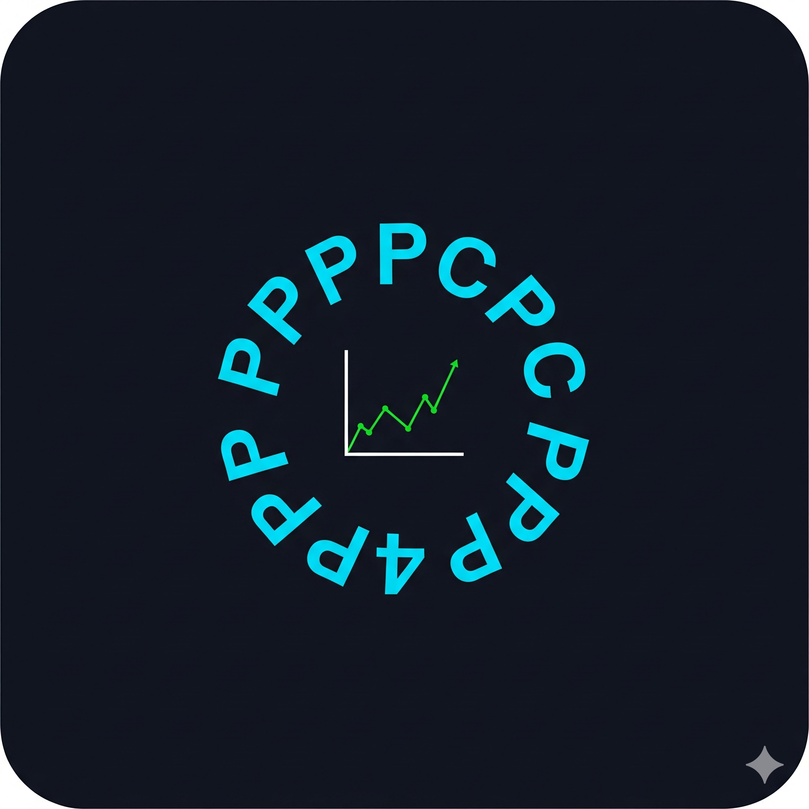

<p align="center">
  
</p>

# 📟 TastyMechanics

A Streamlit dashboard for **theta and wheel strategy traders** on TastyTrade. Built around premium selling — short puts, covered calls, strangles, and the wheel — with metrics that matter for multi-day holds: capture %, daily theta yield, banked $/day, effective basis, and campaign tracking.

Upload your CSV export and get a full breakdown of realized P/L, wheel campaigns, trade analytics, and portfolio health — all running locally or on Streamlit Community Cloud. Your data is never sent anywhere.

> **Heads up for 0DTE traders:** the app works but some metrics (Med Premium/Day, Wheel Campaigns) are less meaningful for same-day trades. 0DTE-specific analytics are on the roadmap.


> **Personal project.** TastyMechanics is built around how I trade — wheel strategies, theta harvesting, and premium selling on TastyTrade. It works well for my account and my style. It may not fit yours out of the box, and that is intentional. If you trade differently — 0DTE, futures, spreads-heavy, non-US — the numbers may not tell the full story. You are welcome to fork the repo and customise it to match your trading style. The codebase is modular by design: analytics live in `mechanics.py`, display in `tabs/`, constants in `config.py`. Changing a metric or adding a new one is usually a small, contained change.

---

## Welcome Screen


  

<a href="https://www.buymeacoffee.com/Cruxis" target="_blank">
  
</a>

---

## Try it online

Hosted on Streamlit Community Cloud — upload your CSV and explore without installing anything:

https://tastymechanics-76dxruw38qjhqc2bdxgfrc.streamlit.app/

---

## Features

**Open Positions tab**
- Position cards per ticker: strategy badge, DTE progress bar, cost basis per leg
- Live market prices via Yahoo Finance (opt-in toggle) — last price, day change %, mark (bid/ask) for each option leg, unrealised P/L per leg and card total
- Per-share unrealised breakdown on stock legs (e.g. `-$620.08 / -$6.20/sh`)
- % of premium captured on single-leg short options (e.g. `23% captured`)
- Spread context row for vertical spreads — net credit/debit, max loss/profit, % of max profit
- Strategy detection covers Iron Condor, Reverse Iron Condor, Iron Butterfly, Reverse Iron Butterfly, Jade Lizard, Big Lizard, Short Strangle, Risk Reversal, vertical spreads, butterflies, calendars, covered structures
- Expiry alert strip — all options expiring within 21 days, colour-coded by urgency
- Wheel Campaign basis strip — cost-basis summary per active campaign
- **Position Snapshot** download button — generates a plain-text snapshot with live marks, IV, Black-Scholes Greeks (Δ, Γ, θ, ν), OTM/ITM distance, open P/L, and portfolio-level metrics (net Δ/Γ/θ/ν, beta-weighted delta to SPY) ready to paste into any LLM for a position review

**Portfolio Overview**
- Realized P/L, Return on Capital, Capital Efficiency Score (annualised)
- Capital deployed, margin loan, dividends + interest
- Inline P/L breakdown chips (campaign type and windowed components)
- Period comparison card — current vs prior equivalent window with deltas

**Derivatives Performance tab**
- Premium selling scorecard: win rate, median capture %, median days held, median premium/day, banked $/day, **Med Daily θ %** (entry quality score — credit ÷ DTE-at-open ÷ capital)
- Avg winner / loser, win/loss ratio, total fees and fees as % of P/L
- Call vs Put performance table
- Defined vs Undefined Risk breakdown by strategy
- Performance by ticker table — includes **Daily θ %** per ticker (median entry quality)
- DTE at open distribution, rolling win rate chart
- Options P/L by week and month (candlestick — shows equity curve OHLC per period)

**Discipline & Patterns tab**
- ThetaGang scorecard: management rate, median DTE at open/close, top-3 concentration, assignment rate, early management rate
- LEAPS automatically separated from short-premium metrics (DTE > 90 threshold)
- Cumulative P/L equity curve, weekly and monthly candlestick curves
- DTE Discipline section — win rate and avg P/L by DTE at open, close distribution with TastyTrade target zone
- Trade Quality section — win/loss P/L histogram, rolling 10-trade capture % and win rate
- Timing & Concentration — P/L by day of week and hour, ticker × month heatmap
- Best/Worst 5 trades and full closed trade log — includes **Daily θ %** column (entry quality, coloured green/orange/red)

**Wheel Campaigns tab**
- Per-ticker campaign cards: entry basis, effective basis, premiums banked, realised P/L, live price strip
- **"Days to Free"** — projected days until effective cost basis reaches $0 at current premium/dividend rate
- Pre-purchase option attribution note when pre-campaign closing debits affect the premium total
- Option roll chain visualisation — calls and puts tracked as separate chains
- Share and dividend event log per campaign
- Lifetime "House Money" mode toggle (in-tab, right of heading)

**Portfolio Realized P/L tab**
- Full ticker breakdown: premiums, dividends, options P/L, capital deployed
- **Stacked cash-flow bar charts** by week and month — Options / Equity / Income breakdown
- Volatility metrics: avg week P/L, weekly std dev, Sharpe-equivalent, profitable weeks %, max drawdown + recovery

**Deposits, Dividends & Fees tab**
- Full income and cash movement log with colour-coded row types

**HTML Report Export**
- Download button in sidebar generates a self-contained fintech dark-theme HTML file (`#111827` bg, teal brand, Inter font)
- Includes: Portfolio Overview (9 KPI cards including Capital Deployed and Closed Wheel P/L), Options scorecard with Med Daily θ %, equity curve, candle charts, Closed Wheel Campaigns table, Performance by Ticker table
- Reflects the currently selected time window; no external dependencies

---

## Getting Started (local)

### Requirements

```
python >= 3.10
streamlit >= 1.31
pandas >= 2.0
plotly >= 5.0
yfinance >= 0.2   # optional — only required for live market prices
```

### Install

```bash
pip install -r requirements.txt
```

### Run

```bash
streamlit run tastymechanics.py
```

Then open `http://localhost:8501` in your browser.

### Getting your CSV from TastyTrade

> Don't have a TastyTrade account yet? [Open one here](https://tastytrade.com/welcome/?referralCode=NT57Z3P85B) — this app was built and tested exclusively on TastyTrade exports.

1. Log in to TastyTrade
2. Go to **History → Transactions**
3. Set your date range — **export your full account history, not just a recent window**
4. Click **Download CSV**
5. Upload the file in the dashboard sidebar

> **Why full history matters:** FIFO cost basis for equity P/L requires all prior buy transactions to be present, even if the shares were purchased years ago. A partial export will produce incorrect basis and P/L figures for any position that has earlier lots outside the selected date range.

---

## Deploying to Streamlit Community Cloud

1. Fork this repository
2. Go to [share.streamlit.io](https://share.streamlit.io) and sign in with GitHub
3. Click **New app** → select your fork → set main file to `tastymechanics.py`
4. Deploy — no secrets or environment variables required

---

## Docker

A standard Python slim image works. Ensure Python 3.10+ is used:

```dockerfile
FROM python:3.12-slim
WORKDIR /app
COPY . .
RUN pip install -r requirements.txt
EXPOSE 8501
CMD ["streamlit", "run", "tastymechanics.py", "--server.port=8501", "--server.address=0.0.0.0"]
```

> **Note:** Python 3.10 and 3.11 are supported. Python 3.12 is recommended.

---

## Disclaimer

This tool is for personal record-keeping only. It is not financial advice.

**Known limitations — verify these manually if they apply to your account:**

- **Covered calls assigned away** — if your shares are called away by assignment, verify the campaign closes and P/L records correctly.
- **Multiple assignments on the same ticker** — each new buy-in starts a new campaign. Blended basis across campaigns is not combined.
- **Long options exercised by you** — exercising a long call or put into shares is untested. Check the resulting position and cost basis.
- **Futures options delivery** — cash-settled futures options (/MES, /ZS etc.) are included in P/L totals, but in-the-money expiry into a futures contract is not handled.
- **Stock splits** — forward and reverse splits are detected and FIFO-adjusted, but TastyTrade-issued post-split option symbols are not stitched to pre-split contracts.
- **Spin-offs and zero-cost deliveries** — shares received at $0 cost (spin-offs, ACATS transfers) trigger a warning. A sidebar toggle lets you exclude those tickers from all P/L metrics so the inflated basis doesn't distort Realized ROR or Capital Efficiency.
- **Mergers and acquisitions** — if a held ticker is acquired or merged, the original campaign may be orphaned with no exit recorded and incomplete P/L. Reconcile manually against your broker statement.
- **Complex multi-leg structures** — PMCC, diagonals, calendars, and ratio spreads may not be classified correctly in the trade log. P/L totals are correct; trade type labels may not be.
- **Non-US accounts** — built and tested on a US TastyTrade account. CSV format and field differences for other regions are unknown.

P/L figures are cash-flow based (what actually hit your account) and use FIFO cost basis for equity. They do not account for unrealised gains/losses, wash sale rules, or tax adjustments. Always reconcile against your official TastyTrade statements for tax purposes.

---

## Architecture

The codebase is split into focused modules with a strict one-way dependency chain. No module imports from the one above it.

```
config.py          Constants + COLOURS palette — OPT_TYPES, TRADE_TYPES, thresholds, patterns
models.py          Dataclasses — Campaign, AppData, ParsedData
ingestion.py       CSV parsing — pure Python, no Streamlit dependency
mechanics.py       Analytics engine — FIFO, campaigns, trade classification
ui_components.py   Visual helpers — formatters, colour functions, chart layout
market_data.py     Live price fetcher — yfinance wrapper, 5-min cache, opt-in only
report.py          HTML report export — self-contained, no Streamlit dependency
tabs/              One renderer per tab (tab0–tab5) + landing.py — imported by tastymechanics.py
tastymechanics.py  Streamlit wiring — sidebar, cache wrappers, tab orchestration
```

**Data flow**

```
CSV upload
  └── load_and_parse(_file_bytes)        cached on raw bytes — reruns only on new file
        └── build_all_data(_parsed, use_lifetime)
                                          cached on use_lifetime bool only (DataFrame unhashed)
              └── window slices recomputed on time window change (fast, uncached)
```

See the [Architecture wiki page](https://github.com/crux1s/TastyMechanics/wiki/Architecture) for full detail.

---

## Changelog

**v26.12 — Code-review follow-ups: covered strangle cap-risk, calendar DTE ordering, `_LegInfo` extraction, hot-path speedup** (2026-06-06)
- **Covered strangle / straddle capital-at-risk** — the v26.11 covered-call short-circuit only checked `has_sc and not has_lc`, so a covered strangle (short call + short put inside a wheel) was returning premium-as-risk and ignoring the unhedged put leg. Real exposure is `put_strike × mult − credit`. The branch now splits explicitly: pure covered call uses premium-as-risk; covered strangle/straddle uses put-strike-as-risk less credit. Caught in the v26.11 PR `/code-review` pass.
- **Calendar spread `nearest_exp` ordering** — `build_closed_trades` was picking `exp_dates.iloc[0]` (first row in transaction-Date order), so a calendar spread where the far-month leg opened first reported the wrong expiration. For a far-then-near calendar this overstated `DTE at Open` by ~5× (e.g. 152 days instead of 30) and silently halved Daily θ %. Fixed to `exp_dates.min()`.
- **`_LegInfo` extraction** — ~16 lines of identical prelude (leg partitions, has-sc/sp/lc/lp flags, butterfly/jade-lizard/ratio detection) were duplicated byte-for-byte between `_classify_trade_type` and `_calculate_capital_risk`. CLAUDE.md flagged it as a known drift hazard. Both functions now consume a single `_LegInfo` dataclass built by `_derive_leg_info(grp, opens)` — structure-detection logic has one source of truth and cannot desynchronise.
- **`build_closed_trades` hot-path speedup** — the `all_closed` check re-filtered `equity_opts` once per symbol inside the trade-group loop, O(T × S × E). On the 700-row test CSV this was ~21M row comparisons; on a 5000-row CSV it scaled to ~1.4B. Now precomputes `sym_net_qty = equity_opts.groupby('Symbol')['Net_Qty_Row'].sum().abs()` once before the loop and looks up per symbol — O(E + T×S), roughly 3000× cheaper on real data.
- Test suite at **365 tests** (18 new synthetic-data regression checks in section 26 covering all three fixes plus a `_LegInfo` consistency spot-check).

**v26.11 — Scorecard cleanup: drop Median Ann Return, fix Daily θ %, covered call accounting** (2026-06-06)
- **Dropped Median Ann. Return from the scorecard** — with a mixed weekly/swing book, more than half of credit trades were pegged at the ±500% cap, making the median equal to the cap and conveying no information. The per-trade Ann Ret % column remains on closed-trade tables for sortable inspection; only the aggregates (scorecard tile, per-ticker summary, HTML report) were removed.
- **Daily θ % now uses DTE-at-open instead of days-held** — converts the metric from "what did I earn per day I held it" (which inflated when closing winners fast) into a setup-quality score: "at the moment I opened the trade, what theoretical theta yield was I buying per unit of capital?" Independent of close timing. Median Daily θ % is now the headline trade-quality number alongside Capture %.
- **Covered call capital-at-risk** — `_calculate_capital_risk` now detects shorts opened inside a wheel campaign window and uses the option premium as the capital base, not `max_strike × 100`. The naked-call formula was misrepresenting covered calls as $700–$5,000 of standalone risk.
- **Wheel campaign same-timestamp close** — a stock exit and option BTC sharing the exact order timestamp (sort order placed equity row before option row) caused the BTC to be dropped from the campaign event log and routed to the outside-window options bucket. A `just_closed` reference now captures it on the campaign side, and `pure_options_pnl` uses an inclusive end boundary to avoid double-counting. Visible bug: SOXS covered-call campaign was reporting +$221.67 instead of the correct +$74.55.
- Test suite at **347 tests** (14 new synthetic-data regression checks pinning the same-timestamp close and covered-call cap-at-risk behaviour).

**v26.10 — TastyTrade-style Date Range Picker** (2026-06-05)
- Time Window selector in tabs 1, 2, 4, 5 replaced with a `st.popover` date-range picker matching TastyTrade's UI. Button shows the live date range (📅 01/06 → 06/06); clicking opens a panel with 10 presets (Today, Yesterday, 7/14/30/60/120 Days, Year to Date, All Time) on the left and a calendar on the right for **Custom** date ranges. Active preset highlighted. Custom mode introduces a user-chosen `end_date` respected throughout the window slice, equity P/L, prior-period comparison, and chart renders.

**v26.9 — Position Snapshot, Fintech Report Theme & Closed Campaign Tests** (2026-06-03)
- **Position Snapshot** — replaces the AI Review Prompt. ⬇️ Snapshot button in the Open Positions tab downloads a plain-text file with live marks, IV, Black-Scholes Greeks (position-adjusted Δ/Γ/θ/ν), OTM/ITM distance, open P/L, gross vs net unrealised on wheel campaigns (showing premium offset explicitly), standalone equity positions, condensed historical scorecard, and portfolio-level Greeks summary including beta-weighted delta to SPY (computed from 90-day rolling returns via `yf.download()`).
- **HTML report fintech theme** — complete visual overhaul: `#111827` background, `#1F2937` cards, teal brand mark, Inter font (Google CDN), pill badges, teal row hover. New sections: Closed Wheel Campaigns table, Capital Deployed + Closed Wheel P/L in Portfolio Overview (9 cards), Med Daily θ % in scorecard.
- **Closed wheel campaign verification** — first real-data test of a fully closed campaign (ACHR: assigned Dec 2025, sold May 2026, net −$78.90 over full cycle).
- **Account Interest row** in Per-Ticker P/L table — debit/credit interest not tied to a specific ticker now appears as an `Account / 💳 Interest` row so the table total matches the Portfolio Overview.
- **Capital Deployed toggle fix** — House Money toggle no longer changes the Capital Deployed figure in the Wheel Campaigns tab.
- Test suite at **333 tests**.

**v26.8 — Daily θ %, Open Positions Enhancements & Fixes** (2026-05-12)
- **Daily θ % metric** — new trade entry quality score: `Prem/Day ÷ Capital at Risk × 100`. Answers "was this trade worth putting on?" at the time of entry, regardless of how it ended. Appears in the Premium Selling Scorecard (Tab 1, 8th card), Performance by Ticker table, and Full Closed Trade Log. Coloured green (≥ 0.10%/day), orange (≥ 0.05%/day), red below — capped at 5%/day to suppress 0DTE distortion.
- **Open Positions tab** — Wheel Campaign basis strip added to active campaign summaries; CSV export button added for the open positions list.
- **Wheel Campaign cards** — live price strip added showing current equity/option marks inline on the card.
- **Fix**: `detect_strategy()` for ratio spreads now counts option quantities instead of row counts, fixing misclassification of multi-row single-expiry ratio spread structures.
- **Fix**: Futures options capital at risk now uses the correct per-product multiplier instead of a hardcoded fallback.
- **UX**: 50% Target column removed from the closed trade log. "Basis Free In" renamed to "Time to B/E".
- Test suite at **324 tests**.

**v26.7 — Open Position Card Fixes & Iron Condor Detection** (2026-04-17)
- **Live option marks now work** — two silent bugs fixed: `itertuples()` was dropping space-containing column names (`Expiration Date` → `_1`) so every mark lookup missed; and TastyTrade exports Saturday OCC settlement dates while yfinance uses the Friday last-trading-day, so the chain fetch never matched. Both fixed.
- **Iron Condor / Reverse Iron Condor / Iron Butterfly / Reverse Iron Butterfly** added to the open positions strategy detector. Previously a four-leg condor was misidentified as Jade Lizard (a subset match). These four structures now take priority and mirror the closed-trades classifier.
- **Strategy badge fix** — vertical call/put spreads (e.g. a bear call credit spread) were showing as `Long Call`. Fixed by replacing an incorrect `lc > 1` guard with proper strike-comparison logic for both call and put spreads.
- **Open position card improvements** — explicit minus sign on negative unrealised P/L (was colour-only); per-share breakdown on stock legs; % of premium captured on single-leg short options; spread context row showing net credit/debit, max loss, and % of max profit.
- Test suite at **311 tests**.

**v26.6 — Ratio Spread & Ratio Lizard Detection** (2026-03-30)
- **Three new strategy labels** — Call Ratio Spread, Put Ratio Spread, and Ratio Lizard (short put + unequal call spread, e.g. -1 45P / +1 65C / -2 70C). Previously these fell through to 'Call Credit Spread' or 'Jade Lizard'.
- **Jade Lizard detection tightened** — now requires equal call quantities on both legs. Unequal-quantity call spreads combined with a short put now correctly classify as Ratio Lizard.
- **Capital risk for ratio spreads** — the extra naked short leg is priced at the highest short strike × 100 minus credit received, reflecting the unbounded exposure.
- Test suite at **307 tests**.

**v26.5 — AI Review Prompt & Per-Ticker P/L Redesign** (2026-03-21)
- **AI Review Prompt** in the sidebar — generates a structured markdown prompt covering win rate, capture %, DTE discipline, concentration, and strategy mix, ready to paste into any AI chat for a trading review.
- **Per-Ticker P/L columns redesigned** — Premiums/Divs/Options → Options / Equity / Income. Options now merges in pre-campaign P/L; Equity is a new FIFO gain/loss column (was previously hidden).
- **Portfolio Overview UX** — metric captions moved to help tooltips, DATA SYNC header replaced with a lighter caption, corporate action warnings collapsed into an expander, period comparison card moved into the Portfolio P/L tab.
- Time window selector labels now visible consistently across all tabs.
- Tab 4 renamed from "All Trades" to **"Portfolio P/L"**.

**v26.4 — Wheel "Days to Free", Stacked Cash-Flow Charts & Tab UX** (2026-03-14)
- **"Days to Free" estimate** on Wheel Campaign cards and summary table — projects how many days at the current premium + dividend collection rate until effective cost basis reaches $0. Displays `~450d`, `✅ Free`, or `—` (no income collected yet). "at current rate" sub-caption flags it as a straight-line projection.
- **Stacked cash-flow bar charts** in the Portfolio Realized P/L tab — weekly and monthly bars now broken into Options (blue), Equity (orange), and Income (green) segments, making it immediately clear which category is driving a positive or negative period.
- **Pre-purchase option attribution banner** on Wheel Campaign cards — amber info note when closing debits from options opened before the share purchase land inside the campaign window without their opening credits.
- **Discipline & Patterns tab reordered** for narrative flow: Cumulative P/L moved to top, both DTE charts grouped under one "DTE Discipline" section, Win/Loss Distribution and Rolling Capture % paired side-by-side under "Trade Quality", timing charts and ticker heatmap under "Timing & Concentration".
- **Fix**: Monthly options equity curve was showing duplicate month labels (e.g. two "Jan 2026") — x-axis ticks now pinned to exact candle positions via `tickvals`/`ticktext`.
- **Rename**: Portfolio Realized P/L tab sections and charts renamed to "Cash Flow" terminology; caption added explaining settlement-date vs closed-trade methodology difference.

**v26.3 — Live Prices & UX Polish** (2026-03-06)
- **Live market prices** on Open Positions tab — opt-in toggle fetches equity quotes and option marks from Yahoo Finance (5-min cache). Shows last price, day change %, mark (bid/ask), and unrealised P/L per leg with a card-level total. Nothing is sent until the toggle is enabled.
- Open Positions cards now show **share quantity** including fractional holdings (e.g. META 0.2 sh)
- Roll chain table column order and labels updated — Date first, `Exp` → Expiry, `Cash` → Credit/Debit Rcvd, `Days` → **Days Held**; closing legs show days the position was held open
- Landing page extracted to `tabs/landing.py` matching the tab renderer pattern
- `market_data.py` added — isolated yfinance wrapper with graceful network-error handling
- `yfinance>=0.2` added to `requirements.txt`

**v25.12 — Charts, Report Export & Fixes** (2026-03-01)
- Weekly and Monthly P/L bar charts replaced with **candlestick charts**
- **HTML report export** — self-contained dark-theme HTML with two scorecard sections, equity curve, candle charts, and performance by ticker table
- Lifetime "House Money" toggle moved into the Wheel Campaigns tab header
- f-string Python 3.10/3.11 compatibility fix; `datetime.utcnow()` deprecation fixed
- 13-colour `COLOURS` palette — all hardcoded hex removed from UI layer
- Test suite expanded to **294 tests** (24 sections); two `detect_strategy()` false positives fixed

**Earlier releases** — v25.3 through v25.11 covered the initial modular refactor (mechanics.py, ingestion.py, tabs/, config.py), FIFO engine fixes, stock split handling, LEAPS separation, and test suite build-out. See git log for detail.

---

## License

[AGPL-3.0](./LICENSE) — free to use, modify, and distribute. If you run a modified version as a public web service you must open source your changes under the same licence.

---

## Support the Project

TastyMechanics is free and open source. If it's saved you time or helped you trade smarter, a coffee goes a long way toward covering the 5-sigma moves.

<a href="https://www.buymeacoffee.com/Cruxis" target="_blank">
  
</a>
&nbsp;&nbsp;
<a href="https://tastytrade.com/welcome/?referralCode=NT57Z3P85B" target="_blank">
  
</a>
